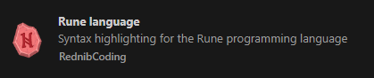

# RuneVM: A Runey Scripting Language


RuneVM is an interpreter for the versatile scripting language "Rune".

Rune is a dynamically typed scripting language designed to be easy to use and implement while remaining practical for real-world tasks. While performance isn't its primary focus, Rune excels in simplicity and flexibility.

Rune is crafted in pure Go, spanning less than 1000 lines of code.

Rune stands out for being:
- **Intuitive:** Designed to be user-friendly and straightforward.
- **Embeddable:** Seamlessly integrates into your Go projects.
- **Extensible:** Easily extendable with custom functions and variables.
- **Portable:** Simple to port to other languages.
- **Versatile:** Can be used standalone as a script runner with the [rune](dist/main.go) binary or embedded as a scripting language within your project.

## Using the Language

### Writing Scripts

Rune scripts have the `.rune` extension. Here is a sample script (`test.rune`):

```rune
myvar = 12;

printer = fun(toPrint) {
    println(toPrint)
};

if myvar == 10 then
    printer("then")
elif myvar == 12 then
    printer("elif 12\n")
elif myvar == 11 then
    printer("elif 11")
else printer("else");

while myvar > 0 do {
    myvar = myvar  -1;
    printer(myvar)
};

if myvar < 0 {
    printer("Is smaller than 0")
} elif myvar > 0 {
    printer("Is biger or than 0")
} else {
    printer("Is exactly 0")
};

if true then printer("Nice") else printer("Also nice");
```

### Running Scripts

To run a script, use the following command:

```
./rune.exe path/to/your/script.rune
```

## Embedding RuneVM in Your Project

To embed RuneVM in your own Go project, follow these steps:

1. Add `runevm` to your project:
    ```
    go get github.com/RednibCoding/runevm
    ```

2. Import RuneVM in your Go code:
    ```go
    import "github.com/RednibCoding/runevm"
    ```

### Example Usage

Here is an example of how to use RuneVM in your Go project:

```go
package main

import (
	"fmt"
	"os"

	"github.com/RednibCoding/runevm"
)

func main() {
	args := os.Args
	if len(args) < 2 {
		fmt.Println("USAGE: rune <sourcefile>")
		os.Exit(1)
	}
	source, err := os.ReadFile(args[1])
	if err != nil {
		fmt.Printf("ERROR: Can't find source file '%s'.\n", args[1])
		os.Exit(1)
	}

	filepath := args[1]
	vm := runevm.NewRuneVM()
	vm.Run(string(source), filepath)
}
```

## Defining Custom Functions and Variables

### Custom Functions

Custom functions can be defined and added to the VM using the `Set` method. Custom functions must have the following signature:

```go
func(args ...interface{}) interface{}
```

Example:

```go
func customPrintFunction(args ...interface{}) interface{} {
    for _, arg := range args {
        switch v := arg.(type) {
        case string:
            fmt.Print(v)
        case int:
            fmt.Print(v)
        case float64:
            fmt.Print(v)
        default:
            return fmt.Errorf("unsupported argument type")
        }
    }
    fmt.Println()
    return nil
}

vm.Set("print", customPrintFunction)

```
>**Note:** It is important to always check the number of arguments and their types, as you don't know what errors users might make in their scripts:
```go

func customPrintFunction(args ...interface{}) interface{} {
    // Check the number of arguments (assuming 2 are expected here)
	if len(args) != 2 {
		return fmt.Errorf("move requires exactly 2 arguments")
	}

	// Using type assertions to check if x and y are of type int
	x, ok1 := args[0].(int)
	y, ok2 := args[1].(int)

	if !ok1 || !ok2 {
		return fmt.Errorf("both arguments must be of type int")
	}

	fmt.Printf("x: %d, y: %d\n", x, y)

	Mover.Move(x, y)
	return nil
}
```


### Custom Variables

Custom variables can be defined and added to the VM using the `SetXXX` methods: `SetInt`, `SetFloat`, `SetString`, `SetBool` and `SetArray`.

Variables can be of type `int`, `float64`, `string`, `bool` or `array`.

Example:

```go
vm.SetString("greetings", "Hello from VM!")
vm.SetInt("myInt", 10)
vm.SetArray("myArr", []string{"One", "Two", "Three"})
vm.SetArray("myArr2", []interface{}{"One", 10, false})
```

## Error Handling

If a custom function returns an error, the interpreter will report it with the line and column number where the error occurred.

Example:

```go
func customPanicPrinter(args []interface{}) error {
    for _, arg := range args {
        if arg == "panic" {
            return fmt.Errorf("intentional panic triggered")
        }
        fmt.Print(arg)
    }
    return nil
}
```

If the `customPanicPrinter` function encounters the string `"panic"`, it will return an error, and the interpreter will handle and report it.

```
customPanicPrinter("panic")
```
output:
```
error (example.rune:1:6): Error in function call: 'intentional panic triggered'
```

## Using Functions and Variables defined in Rune from Go
You can get function defined in `Rune` via the `GetFun` function:

Let's say in rune you have the following function named "printer"
```
printer = fun(printme) {
    println(printme)
}
```

You can get this function by first, running the script and then call `GetFun` afterwards:
```go
vm := runevm.NewRuneVM()
vm.Run(string(source), filepath)

printerFunc, err := vm.GetFun("printer")
if err != nil {
    fmt.Println(err)
    return
}

// call the function
printerFunc("Hello From PrinterFunc")
```

Output:
```
Hello From PrinterFunc
```

Similarely you can retrieve the value of variables.

Lets say you have a string variable defined in rune like so:

```
toPrint = "I am the toPrint variable"
```

Then you can get the value of it by calling `GetString`:

```go
toPrint, err := vm.GetString("toPrint")
if err != nil {
    fmt.Println(err)
}

fmt.Println(toPrint)
```

output:
```
I am the toPrint variable
```

You can also execute a function defined in rune with a variable defined in rune as argument.

Lets combine the above:

```
toPrint = "I am the toPrint variable"

printer = fun(printme) {
    println(printme)
}
```

And in go we can do:
```go
vm := runevm.NewRuneVM()
vm.Run(string(source), filepath)

// Get the printer function from rune
printerFunc, err := vm.GetFun("printer")
if err != nil {
    fmt.Println(err)
    return
}

// Get the 'toPrint' variable from rune
toPrint, err := vm.GetString("toPrint")
if err != nil {
    fmt.Println(err)
}

// Use both
printerFunc(toPrint)
```

output:
```
I am the toPrint variable
```

Analogous to `GetString` are the functions: `GetInt`, `GetFloat`, `GetBool` and `GetArray`.


# Rune Language Specification

The Rune language is a simple, dynamic scripting language. The following chapter describes the syntax and features of the Rune language, including how to define and call functions, use variables, control flow with `if` and `while` statements, data types and falsy values.

## Defining and Calling Functions

### Defining Functions

Functions in Rune are defined by assigning a function to a name.

Example:

```rune
greet = func() {
    print("Greetings")
}
```

### Calling Functions

Functions are called using the name followed by parentheses and optional arguments.

Example:

```rune
greet()
```

## Defining and Using Variables

### Defining Variables

Variables in Rune are defined by assigning a value to a name using the `=` operator. Variables are dynamically typed and can hold numbers, strings or booleans.

Example:

```rune
message = "Hello, World!";
count = 42;
pi = 3.14;
isTrue = true;
```

### Using Variables

Variables can be used in expressions and statements.

Example:

```rune
println(message)
print("The count is: ", count)
```

## Control Flow

### If Statements

The `if` statement is used to execute a block of code conditionally. The `else` and `elif` keywords can be used for additional conditions.

Example:

```rune
if count > 10 {
    print "Count is greater than 10\n"
} elif count == 10 {
    print "Count is 10\n"
} else {
    print "Count is less than 10\n"
}
```

### While Statements

The `while` statement is used to execute a block of code repeatedly as long as a condition is true.

Example:

```rune
x = 0
while x < 5 {
    print "x is ", x, "\n"
    x = x + 1
}
```

## Data Types

### Number

Numbers in Rune can be of type `int` or `float64`. They are used in mathematical expressions and comparisons.

Example:

```rune
a = 10
b = 3.14
result = a * b
```

### String

Strings in Rune are sequences of characters enclosed in double quotes `"`.

Example:

```rune
greeting = "Hello, World!";
print(greeting);
```

### Bool

Booleans in Rune can have one of two values: `true` and `false`.

```rune
runeIsAwesome = true

if runeIsAwesome then println("Rune is awesome!") else println("This should never print! ;)")
```

## Falsy Values

In Rune, the following values are considered falsy:
- The number `0`
- The empty string `""`
- The boolean value `false`

Any other value is considered truthy.

### Example of Falsy Values

```rune
if 0 {
    println("This will not print")
} else {
    println("0 is falsy")
}

if "" {
    println("This will not print")
} else {
    println("Empty string is falsy")
}

if false {
    println("This will not print")
} else {
    println("false is falsy ;)")
}

```

## Arrays
In rune you can define an array by binding it to a name:
```
myArr = array{"hello", 10, false, 20, 30}
```
Arrays can have values of different types.

To access an array by index you can use the name followed by an index enclosed in square brackts (arrays are zero based):
```
first = myArr[0]
println(first) # output: "hello"
```

## Maps / Type
In rune you can define a map by binding it to a name:
```
myMap = map{"key1": 1, "key2": false}
```
Maps can have values of different types, but keys must be of type `string`.

To access a map field by key you can use the name followed by an key enclosed in square brackts:
```
second = myMap["key2"]
println(second) # output: false
```

>**Note**: keys are unique, this means adding a value with a key that already exists, the **existing value get overriden**:
```
myMap = map{"uid": "10"}
println(myMap) # output: {"uid": 10}
myMap = append(myMap, "uid", "Hello World")
println(myMap) # output: {"uid": "Hello World"}
```

### Field Access
It is possible to access the fields of a map also via the `.`.
Both expressions are the same under the hood:
```
myMap = map{"uid": "10"}
println(myMap["uid"]) # output: 10
println(myMap.uid) # output: 10
```

Syntactic suger is you can write `type` instead of `map` to make the usecase more clear.
Both expressions are the same under the hood:
```
myMap = map{"uid": "10"}
myMap = type{"uid": "10"}
```


## Short-hand with `if` `then` and `elif` `then`
The `if`-statement can be written on one line with the `then` keyword:

Both if statements are the same:
```rune
runeIsAwesome = true;

if runeIsAwesome then println("Rune is awesome") elif runeIsAwesome != true then println("Oh to bad") else println("This should never print! :)");

if runeIsAwesome {
    println("Rune is awesome")
}elif runeIsAwesome != true {
    println("Oh to bad")
} else {
    println("This should never print! :)")
}
```

## Builin Functions

### print
- **Syntax**: `print(<arg1>, <arg2>, ...)`
- **Description**: Prints the given arguments to the standard out
- **Example**: `print("Hello, World times ", 10)`

### println
- **Syntax**: `println(<arg1>, <arg2>, ...)`
- **Description**: Prints the given arguments to the standard out and adds a newline character at the end
- **Example**: `print("Hello, World times ", 10)`

### wait
- **Syntax**: `wait(<milliseconds>)`
- **Description**: Waits the given amout of milliseconds
- **Example**: `wait(2000)`

### exit
- **Syntax**: `exit()`
- **Description**: Exits the execution immediately
- **Example**: `exit()`

### typeof
- **Syntax**: `typeof(<arg>)`
- **Description**: Returns the type name as a string of the given argument. Possible types are: `int`, `float`, `string`, `bool` and`unknown`.
- **Example**: `typeof(10) # returns "int"`

### append
- **Syntax**: `append(<array|map|string>, <value>)`
- **Description**: Appends the given value to the given array, map or string. Returns the new array, map or string.
- **Example**: `myArr = append(myArr, 10)`

### remove
- **Syntax**: `remove(<array|map|string>, <index>)`
- **Description**: Removed the given index from the given array, map or string. Returns the new array, map or string.
- **Example**: `myArr = remove(myArr, 2)`

### haskey
- **Syntax**: `haskey(<map>, <key>)`
- **Description**: Returns true if the given map has the given key, otherwise false.
- **Example**: `hasTheKey = haskey(myMap, "TheKey")`

### slice
- **Syntax**: `slice(<array|map|string>, <start>, <end>)`
- **Description**: Returns a slice of the given array, map, or string from the start index to the end index.
- **Example**: `slicedArray = slice(myArray, 1, 3)`

### slicefirst
- **Syntax**: `slicefirst(<array|map|string>, <end>)`
- **Description**: Returns a slice of the given array, map, or string from the start to the given end index.
- **Example**: `slicedArray = slicefirst(myArray, 2)`

### slicelast
- **Syntax**: `slicelast(<array|map|string>, <start>)`
- **Description**: Returns a slice of the given array, map, or string from the given start index to the end.
- **Example**: `slicedArray = sliceLast(myArray, 3)`

### len
- **Syntax**: `len(<array|map|string>)`
- **Description**: Returns the lenght of the given array, map or string.
- **Example**: `arrLen = len(myArr)`

### new
- **Syntax**: `new(<array|map>)`
- **Description**: Returns a deep copy of the given array or map.
- **Example**: `map2 = new(map1)`

## Editor Plugins
In the `editor` directory you will find plugins for different editors. Currently for (help is welcome):
 - [VS Code](https://code.visualstudio.com/)

    

 The `readme.md` in each directory explains how to install them.